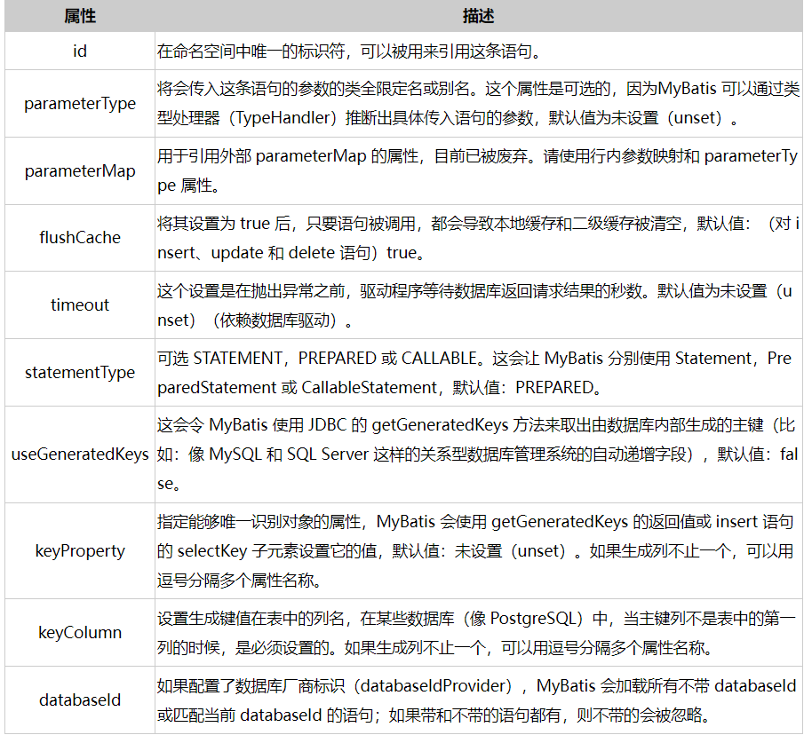

属性	描述
id	    在命名空间中唯一的标识符，可以被用来引用这条语句。
parameterType	    将会传入这条语句的参数的类全限定名或别名。这个属性是可选的，因为MyBatis 可以通过类型处理器（TypeHandler）推断出具体传入语句的参数，默认值为未设置（unset）。
parameterMap	    用于引用外部 parameterMap 的属性，目前已被废弃。请使用行内参数映射和 parameterType 属性。
flushCache	        将其设置为 true 后，只要语句被调用，都会导致本地缓存和二级缓存被清空，默认值：（对 insert、update 和 delete 语句）true。
timeout	这个设置是在抛出异常之前，驱动程序等待数据库返回请求结果的秒数。默认值为未设置（unset）（依赖数据库驱动）。
statementType	可选 STATEMENT，PREPARED 或 CALLABLE。这会让 MyBatis 分别使用 Statement，PreparedStatement 或 CallableStatement，默认值：PREPARED。
useGeneratedKeys	这会令 MyBatis 使用 JDBC 的 getGeneratedKeys 方法来取出由数据库内部生成的主键（比如：像 MySQL 和 SQL Server 这样的关系型数据库管理系统的自动递增字段），默认值：false。
keyProperty	指定能够唯一识别对象的属性，MyBatis 会使用 getGeneratedKeys 的返回值或 insert 语句的 selectKey 子元素设置它的值，默认值：未设置（unset）。如果生成列不止一个，可以用逗号分隔多个属性名称。
keyColumn	设置生成键值在表中的列名，在某些数据库（像 PostgreSQL）中，当主键列不是表中的第一列的时候，是必须设置的。如果生成列不止一个，可以用逗号分隔多个属性名称。
databaseId	如果配置了数据库厂商标识（databaseIdProvider），MyBatis 会加载所有不带 databaseId 或匹配当前 databaseId 的语句；如果带和不带的语句都有，则不带的会被忽略。

